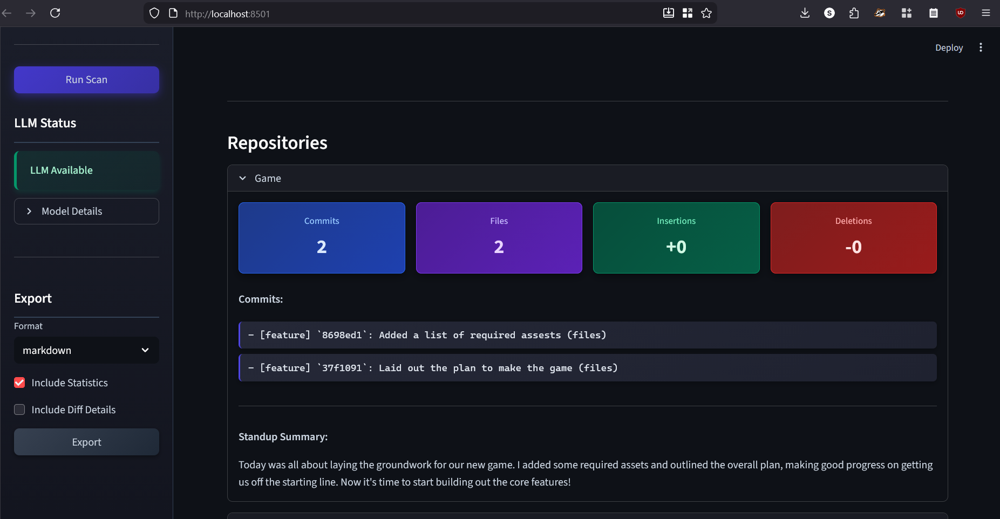

# DevDiary
_Automated Developer Activity Summarizer with LLM Integration_



DevDiary is a personal developer journal assistant that automates the logging, summarization, and reporting of Git-based activity across multiple projects. It helps developers effortlessly prepare stand-up updates, weekly retrospectives, and maintain clear work logs; all powered by open-source LLMs.

## Features

- Scans Git commits across all or selected repositories
- Supports daily, weekly, monthly, and custom date ranges
- Summarizes commit activity using local LLMs via [Ollama](https://ollama.com/)
- Generates natural-language stand-up summaries
- Filters out irrelevant files (e.g., venvs, .git, __pycache__)
- Displays file diffs with insertions/deletions per commit
- CLI + full Streamlit Application

## Tech Stack

- Python 3.11 or 3.12 (recommended)
- Git CLI
- [Ollama](https://ollama.com/) + LLaMA 3 for local LLM inference
- Streamlit (GUI)
- Click (CLI)
- `subprocess`, `pathlib`, and `datetime` for Git interaction

## Installation

```bash
# Clone the repository
git clone https://github.com/yourusername/dev-diary.git
cd dev-diary

# Set up virtual environment
python -m venv .venv
source .venv/bin/activate  # Windows: .venv\Scripts\activate

# Install dependencies
pip install -r requirements.txt
```

## Setting Up Ollama

Install [Ollama](https://ollama.com/) and pull a model like LLaMA 3:

```bash
ollama pull llama3
```

Make sure the Ollama server is running in the background.

## Running the App

```bash
streamlit run ui\streamlit_app.py
```

## Using the CLI

```bash
python main.py summarize --all-projects --mode weekly --summarize --output summary.txt
```

### CLI Options:
- `--all-projects`: Scan all Git repos under `~/dev`
- `--root`: Specify a custom root folder
- `--mode`: `today`, `weekly`, `monthly`, or `custom:YYYY-MM-DD`
- `--summarize`: Enable LLM summarization
- `--output`: Save output to file


## Future Work

- GitHub/GitLab remote integration
- Task-level and branch-aware summaries
- Fine-tuned summarization models
- PDF/Markdown export of journal logs


